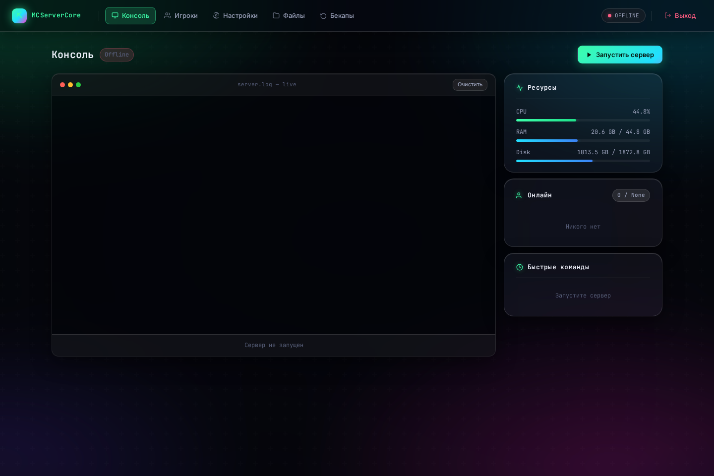
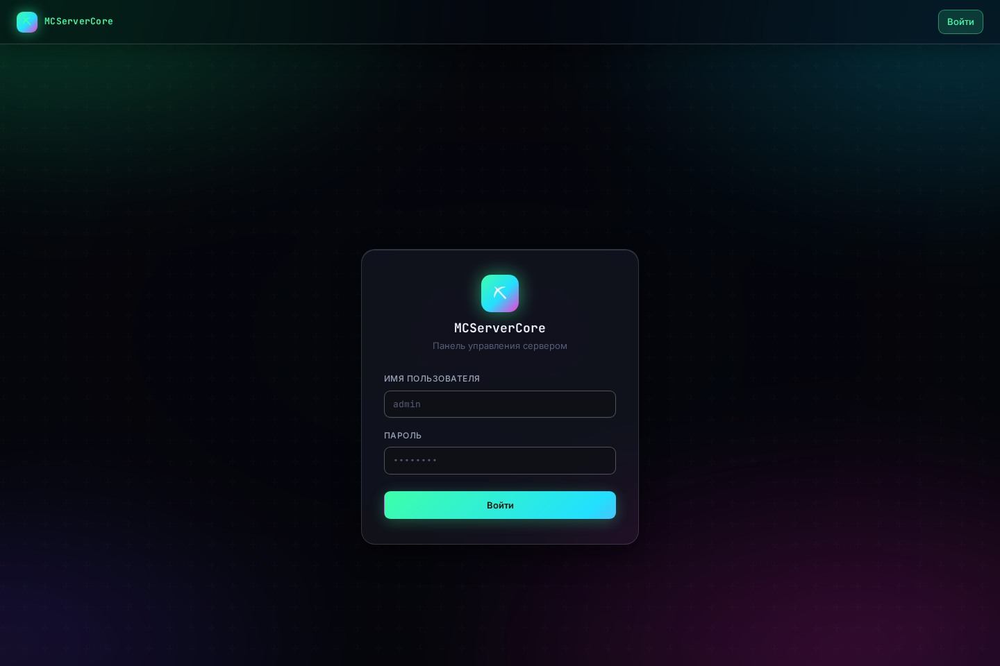

# MCServerCore

Self-hosted веб-панель для управления Minecraft-сервером: живая консоль,
старт/стоп/kill, `server.properties`, игроки (онлайн/вайтлист/баны/опы),
файловый менеджер и бекапы — всё из браузера, без прямого SSH на сервер.

<p align="center">
  
  
</p>

## Возможности

- **Живая консоль** сервера через WebSocket (вывод стримится построчно, ввод команд из браузера)
- **Старт / стоп / kill** управляемого Java-процесса
- **Игроки** — кто онлайн прямо сейчас, вайтлист, баны, операторы; op/deop/kick/ban/pardon одной кнопкой
- **`server.properties`** — редактирование настроек сервера из UI
- **Файловый менеджер** — просмотр/создание/переименование/удаление внутри папки сервера
- **Бекапы** — создание, переименование, удаление снапшотов
- **Роли**: `admin` (полный доступ) и `viewer` (только просмотр — без команд, без файлов/бекапов)
- Мониторинг CPU/RAM/диска в реальном времени

## Быстрый старт

```bash
git clone https://github.com/Danikky/MCServerCoreWebUI.git
cd MCServerCoreWebUI
./setup.sh     # venv + зависимости + папка server/
./launch.sh    # запуск на http://localhost:5245
```

При первом запуске панель сама создаёт администратора и печатает
случайный пароль в консоль — сохрани его, второй раз он не покажется.
Положи `.jar`-ядро сервера (или `.sh`/`.bat`-скрипт запуска) в `server/` —
панель подхватит его автоматически при нажатии «Старт».

Все настройки — через переменные окружения (или файл `.env`), полный
список и дефолты — в [.env.example](.env.example).

## Деплой в прод

Отдельный домен + HTTPS + systemd + nginx как reverse proxy для
WebSocket — пошагово в [DEPLOY.md](DEPLOY.md).

## Стек

Flask + Flask-SocketIO (живая консоль) + Flask-Login + SQLAlchemy,
Jinja2-шаблоны без сборки фронтенда, тёмная стеклянная тема на чистом CSS.
Архитектура пакета описана в [CLAUDE.md](CLAUDE.md#architecture).

## Статус проекта

Проект активно допиливается — открытый список того, что уже сделано,
что чинится и что планируется, ведётся в [REVIEW.md](REVIEW.md).

## Лицензия

[PolyForm Noncommercial 1.0.0](LICENSE) — используй, форкай, меняй,
распространяй свободно для любых **некоммерческих** целей. Зарабатывать
на этом коде (продавать хостинг на его основе, брать деньги за доступ и
т.п.) может только правообладатель. Подробности — в файле [LICENSE](LICENSE).
